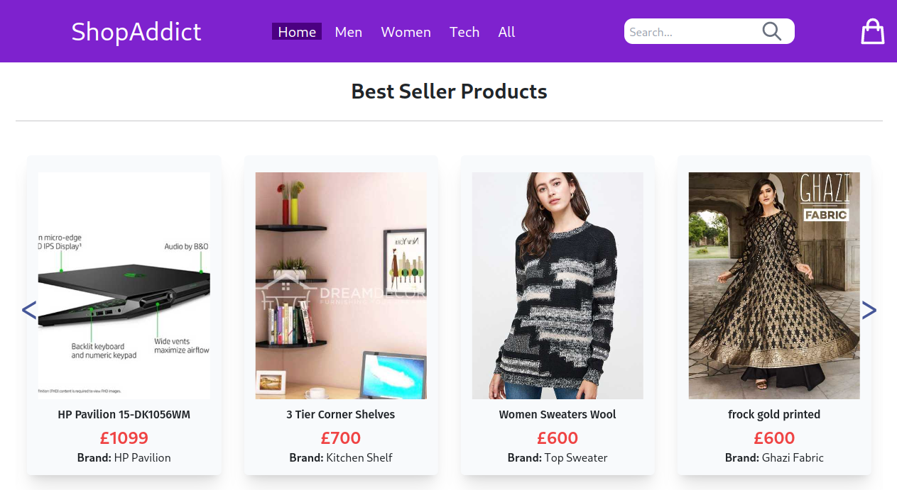

<a id="readme-top"></a>

<div align="center">
<h1 align="center">Online eCommerce website - ShopAddict </h1>
<a href="https://github.com/apyosi/ecommerce-shop/graphs/contributors"></a>
<a href="https://github.com/apyosi/ecommerce-shop/network/members"></a>
<a href="https://github.com/apyosi/ecommerce-shop/stargazers"></a>
<a href="https://github.com/apyosi/ecommerce-shop/issues"></a>
<a href="https://opensource.org/licenses/MIT"></a><br>
<h2><a href="https://transcendent-kringle-16abc9.netlify.app/" target="_blank"">View Demo</a></h2><br>
</div>

<details open>
  <summary>Table of Contents</summary>
  <ol>
    <li><a href="#description">Description</a></li>
    <li><a href="#screenshots">Screenshots</a></li>
    <li><a href="built-with">Built with</a></li>
    <li><a href="#installation">Installation</a></li>
    <li><a href="#usage">Usage</a></li>
    <li><a href="#contributing">Contributing</a></li>
    <li><a href="#tests">Tests</a></li>
    <li><a href="#license">License</a></li>
    <li><a href="#questions">Questions</a></li>
  </ol>
</details>

<h2 id="description">🧾 Description</h2>


 Fully responsive React eCommerce application deployed on Netlify!

<p align="right">(<a href="#readme-top">back to top</a>)</p>

<h2 id="screenshots"> 🖼️ Screenshots</h2>




<p align="right">(<a href="#readme-top">back to top</a>)</p>

<h2 id="built-with">🛠️ Built with</h2>

<a href="https://developer.mozilla.org/en-US/docs/Glossary/HTML5" target="_blank" rel="noreferrer" ></a>
<a href="https://www.w3.org/TR/CSS/#css" target="_blank" rel="noreferrer" ></a>
<a href="https://developer.mozilla.org/en-US/docs/Web/JavaScript" target="_blank" rel="noreferrer" ></a>
<a href="https://tailwindcss.com/" target="_blank" rel="noreferrer" ></a>
<a href="https://nodejs.org/en/" target="_blank" rel="noreferrer" ></a>
<a href="https://www.npmjs.com/" target="_blank" rel="noreferrer" ></a>
<a href="https://reactjs.org/" target="_blank" rel="noreferrer" ></a>
<a href="https://reactrouter.com/" target="_blank" rel="noreferrer" ></a>
<a href="https://webpack.js.org/" target="_blank" rel="noreferrer" ></a>
<a href="https://git-scm.com/" target="_blank" rel="noreferrer" ></a>
<a href="https://github.com/" target="_blank" rel="noreferrer" ></a>
<a href="https://www.markdownguide.org/" target="_blank" rel="noreferrer" ></a>
<a href="https://www.json.org/json-en.html" target="_blank" rel="noreferrer" ></a>
<a href="https://fontawesome.com/" target="_blank" rel="noreferrer" ></a>
<a href="https://postcss.org/" target="_blank" rel="noreferrer" ></a>
<a href="https://www.netlify.com/" target="_blank" rel="noreferrer" ></a>
<a href="https://code.visualstudio.com/" target="_blank" rel="noreferrer" ></a>
<a href="https://eslint.org/" target="_blank" rel="noreferrer" ></a>
<a href="https://prettier.io/" target="_blank" rel="noreferrer" ></a>
<a href="https://www.mozilla.org/en-US/firefox/new/" target="_blank" rel="noreferrer" ></a>
<a href="https://www.google.com/chrome/" target="_blank" rel="noreferrer" ></a>
<a href="https://www.microsoft.com/en-us/edge" target="_blank" rel="noreferrer" ></a>
<a href="https://www.apple.com/safari/" target="_blank" rel="noreferrer" ></a>
<a href="https://slack.com/" target="_blank" rel="noreferrer" ></a>
<a href="https://zoom.us/" target="_blank" rel="noreferrer" ></a>

<p align="right">(<a href="#readme-top">back to top</a>)</p>

<h2 id="installation">💾 Installation</h2>

Clone the repository: `git@github.com:apyosi/ecommerce-shop.git`

Navigate in the folder: `cd ecommerce-shop`

Install all the required dependencies:  `npm install`

<p align="right">(<a href="#readme-top">back to top</a>)</p>

<h2 id="usage">▶️ Usage</h2>

In the project directory, run in cli the following command: ```npm start```

Runs the app in the development mode.
Open http://localhost:3000 to view it in your browser.

The page will reload when you make changes.
 You may also see any lint errors in the console.

<p align="right">(<a href="#readme-top">back to top</a>)</p>

<h2 id="contributing">🧑🏻‍🔧 Contributing</h2>

Contributions are always welcome!

<p align="right">(<a href="#readme-top">back to top</a>)</p>

<h2 id="tests">🧪 Tests</h2>

To run the test, run the following command: 

### `npm test`

Launches the test runner in the interactive watch mode.
 See the section about [running tests](https://facebook.github.io/create-react-app/docs/running-tests) for more information.

### `npm run build`

Builds the app for production to the `build` folder.
 It correctly bundles React in production mode and optimizes the build for the best performance.

The build is minified and the filenames include the hashes.
 Your app is ready to be deployed!

See the section about [deployment](https://facebook.github.io/create-react-app/docs/deployment) for more information.

<p align="right">(<a href="#readme-top">back to top</a>)</p>

<h2 id="license">🔍 License</h2>

<a href="https://opensource.org/licenses/MIT"></a>

<p align="right">(<a href="#readme-top">back to top</a>)</p>

<h2 id="license">🫂 Authors</h2>

[apyosi](https://github.com/apyosi)

[KodeIva](https://github.com/KodeIva)

[RobH95](https://github.com/RobH95)

[Ramaz-Didi](https://github.com/Ramaz-Didi)

<p align="right">(<a href="#readme-top">back to top</a>)</p>

<h2 id="questions">❓ Questions</h2>

You can reach us for any questions on the github repo page: [https://github.com/apyosi/ecommerce-shop](https://github.com/apyosi/ecommerce-shop)

<p align="right">(<a href="#readme-top">back to top</a>)</p>


